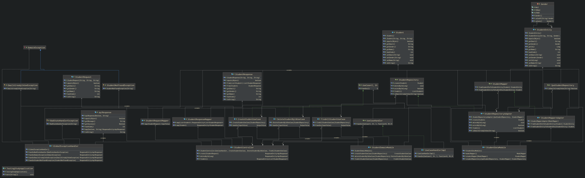

# Spring Boot + Clean Architecture + TDD Study

- Projeto criado com o intuito de estudar JUnit e Mockito no ambiente Spring Boot.
    - Implementação foi inspirada no [video](https://www.youtube.com/watch?v=Geq60OVyBPg).
- Ainda, a ideia do projeto consiste em aplicar conceitos de _TDD_, _Clean Code_, _Hexagonal Architecture_ e _Clean
  Architecture_.
    - Essa aplicação é inspirada pelos seguintes repositórios e blog posts:
        - [Introduction about Clean Architecture Part 1](https://huongdanjava.com/introduction-about-clean-architecture-part-1.html)
        - [Introduction about Clean Architecture Part 2](https://huongdanjava.com/introduction-about-clean-architecture-part-2.html)
        - [Hands On Hexagonal Architecture with Spring Boot](https://github.com/sofieneBK/hands-on-hexagonal-architecture-with-spring-boot)
        - [Clean Architecture Delivery Example](https://github.com/eliostvs/clean-architecture-delivery-example)
        - [Account Service (Hexagonal Architecture Example)](https://github.com/tugcekonuklar/account-service)
        - [API REST playlist by Rodrigo Branas](https://www.youtube.com/watch?v=yZifRUvxdAk)
        - [Typescript, TDD e Clean Architecture playlist by Mango](https://www.youtube.com/watch?v=czq_8MsjTJY)
        - [Domain-Driven Refactoring by Jimmy Bogard](https://www.youtube.com/watch?v=_dQRAsVhCqA)
        - [Clean Architecture Introduction](https://inforside.com/clean-architecture-introduction/)
----
## UML

----

## Endpoints

<table border="0">
    <thead>
        <tr>
            <th>Endpoint</th>
            <th>Verbo HTTP</th>
            <th>Response</th>
        </tr>
    </thead>
    <tbody>
        <tr>
            <td><pre>/api/v1/school-system/students</pre></td>
            <td><strong>GET</strong></td>
            <td><pre>
{
  "name" : "Vincent",
  "email" : "TheHappyJock@outlook.co",
  "gender" : "MALE"
}
            </pre></td>
        </tr>
        <tr>
            <td><pre>/api/v1/school-system/students</pre></td>
            <td><strong>POST</strong></td>
            <td><pre>
{
  "name" : "Vincent",
  "email" : "TheHappyJock@outlook.co",
  "gender" : "MALE"
}
            </pre></td>
        </tr>
        <tr>
            <td><pre>/api/v1/school-system/students</pre></td>
            <td><strong>DELETE</strong></td>
            <td><pre>none</pre></td>
        </tr>
    </tbody>
</table>

----
